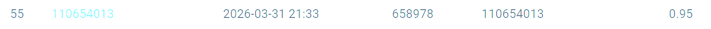

# NYCU Selected Topics in Visual Recognition using Deep Learning 2026

Coursework portfolio for **Selected Topics in Visual Recognition using Deep Learning** at National Yang Ming Chiao Tung University (NYCU), 2026.

- Student ID: `110654013`
- Framework: PyTorch / Torchvision
- Language: Python

This repository contains four homework projects covering image classification, object detection, instance segmentation, and all-in-one image restoration. Each homework directory is self-contained and includes its own environment requirements, training and inference commands, experiment notes, and leaderboard evidence.

## Homework Overview

| Homework | Task | Main Method | Result | Documentation |
|---|---|---|---:|---|
| HW1 | 100-class image classification | ResNet-50 / ResNet-101, MixUp, CutMix, TTA, 3-model logit ensemble | Public score **0.95** | [HW1 README](hw1/README.md) |
| HW2 | Digit object detection | DETR ResNet-50 / DC5 variants, checkpoint selection, NMS-based model fusion | Public score **0.40**; validation AP **0.48975** | [HW2 README](hw2/README.md) |
| HW3 | Cell instance segmentation | Mask R-CNN ResNet50-FPN, small-cell anchors, whole-image and tiled inference ensemble | Public score **0.5896** | [HW3 README](hw3/README.md) |
| HW4 | Rain and snow image restoration | PromptIR, TTA, MSE and perceptual-loss branches, weighted ensemble | Public score **30.40 PSNR** | [HW4 README](hw4/README.md) |

## Highlights

### HW1 — Image Classification

- Trained ResNet-50 models with different random seeds and a ResNet-101 model.
- Used label smoothing, MixUp, CutMix, automatic mixed precision, and horizontal-flip TTA.
- Produced the final prediction through three-model logit averaging.

[View implementation and commands](hw1/README.md)



### HW2 — Object Detection

- Followed the homework constraint of using DETR with a ResNet-50 backbone and no external training data.
- Compared standard ResNet-50 and DC5 DETR variants across multiple configurations and seeds.
- Added validation-aware checkpoint selection, prediction fusion, NMS, and soft-NMS experiments.

[View implementation and commands](hw2/README.md)


### HW3 — Instance Segmentation

- Built a Torchvision Mask R-CNN ResNet50-FPN pipeline for four cell categories.
- Added small-object anchors and high detection capacity for dense cell images.
- Combined epoch-30 and epoch-40 checkpoints with whole-image and overlapping tiled inference.
- Used class-wise mask NMS and agreement-based score calibration for the final submission.

[View implementation and commands](hw3/README.md)


### HW4 — All-in-One Image Restoration

- Implemented a PromptIR-based restoration pipeline for mixed rain and snow degradations.
- Combined a PSNR-oriented MSE continuation model with a reference-style perceptual-loss branch.
- Applied TTA and weighted prediction ensembling to obtain the final submission.

[View implementation and commands](hw4/README.md)


## Repository Structure

```text
.
├── hw1/    # Image classification
├── hw2/    # DETR object detection
├── hw3/    # Mask R-CNN instance segmentation
├── hw4/    # PromptIR image restoration
└── README.md
```

Each homework directory provides a dedicated `README.md` and `requirements.txt`. Training outputs, model checkpoints, competition datasets, and generated submissions are intentionally excluded from GitHub.

## Getting Started

Clone the repository:

```bash
git clone https://github.com/Jackson8787/NYCU-Selected-Topics-in-Visual-Recognition-using-Deep-Learning-2026.git
cd NYCU-Selected-Topics-in-Visual-Recognition-using-Deep-Learning-2026
```

Enter the homework directory you want to reproduce and create an isolated environment. For example:

```bash
cd hw1
python -m venv .venv
source .venv/bin/activate  # Windows: .venv\Scripts\activate
python -m pip install -r requirements.txt
```

Then follow that homework's README for dataset placement, training, evaluation, inference, and submission generation:

- [HW1 setup and usage](hw1/README.md)
- [HW2 setup and usage](hw2/README.md)
- [HW3 setup and usage](hw3/README.md)
- [HW4 setup and usage](hw4/README.md)

## Data and Reproducibility Notes

- Official course datasets must be downloaded separately according to each homework specification.
- Dataset archives, checkpoints, outputs, and competition submissions are not committed because of size and course distribution restrictions.
- Paths and commands in the homework READMEs assume that the corresponding dataset has been placed in the documented location.
- Results may vary with hardware, CUDA/cuDNN versions, dependency versions, random seeds, and checkpoint selection.
- No prohibited external training data or task-specific foundation models are used in the reported final methods.

## Academic Use

This repository is published as a coursework record and reproducibility reference. If you are taking the same or a related course, follow your institution's academic integrity policy and do not submit this work as your own.
