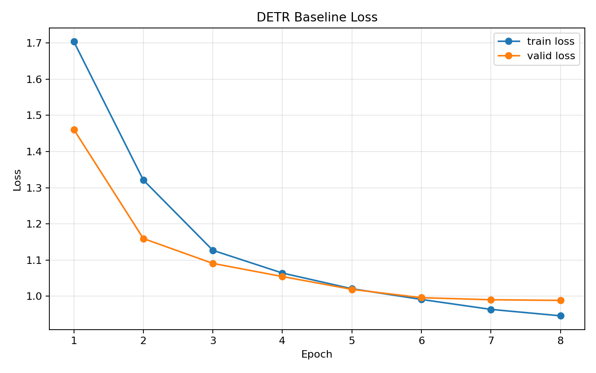
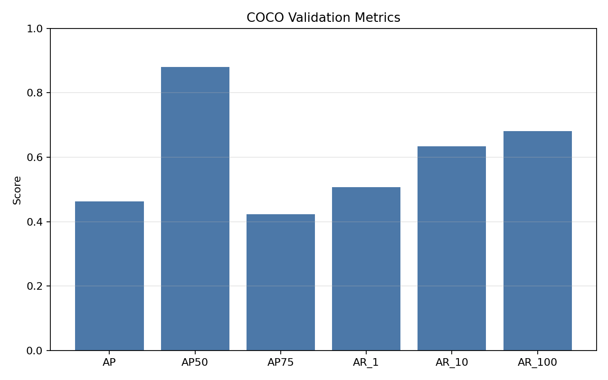

# NYCU Selected Topics in Visual Recognition using Deep Learning 2026 HW2

- Student ID: `110654013`

## Introduction

This project is a DETR-based digit detection system for the NYCU Selected Topics
in Visual Recognition using Deep Learning 2026 Homework 2 competition.

The homework requires using DETR with a ResNet-50 backbone and forbids external
data. The final system keeps the official DETR setting as the base, then
improves performance through validation-aware checkpoint selection, multiple
DETR variants, and prediction fusion with post-processing.

Final selected method:

- `facebook/detr-resnet-50-dc5`
- `facebook/detr-resnet-50`
- additional DC5 / ResNet-50 variants with different training settings and seed
- multi-model ensemble on prediction JSON files
- final soft-NMS style post-processing

Project structure:

```text
hw2_project/
  README.md
  requirements.txt
  run_baseline.py
  configs/
    *.json
  src/
    train.py
    evaluate.py
    predict.py
    ensemble.py
    visualize.py
    data.py
    utils.py
  assets/
    performance snapshot.png
    loss_curve.png
    valid_metrics.png
```

Dataset source:

- The official homework dataset should be downloaded separately and placed in
  `nycu-hw2-data/`.
- This repository does not bundle the dataset, checkpoints, or generated
  outputs.

## Environment Setup

The environment specification in this repository was exported from the current
working Python environment and saved to `requirements.txt`.

Check the interpreter:

```powershell
python --version
```

Create and activate a fresh environment if needed, then install the required
packages:

```powershell
python -m venv .venv
.venv\Scripts\activate
python -m pip install -r requirements.txt
```

## Usage

### Training / Evaluation / Submission in One Script

The main entry point is `run_baseline.py`. It can run training, validation
evaluation, visualization, and final submission generation in one command.

Run the full pipeline:

```powershell
python run_baseline.py --config configs/dc5_480_noaug_map.json --score-threshold 0.001 --max-detections-per-image 100
```

Run a specific stage only:

```powershell
python run_baseline.py --config configs/dc5_480_noaug_map.json --mode train
python run_baseline.py --config configs/dc5_480_noaug_map.json --mode eval
python run_baseline.py --config configs/dc5_480_noaug_map.json --mode predict
```

Run a smoke test:

```powershell
python run_baseline.py --config configs/baseline.json --smoke
```

### Important Configurations

Main configs used in experiments:

```text
configs/dc5_480_noaug_map.json
configs/r50_480_noaug.json
configs/r50_480_noaug_map.json
configs/dc5_480_continue_map.json
configs/dc5_480_noaug_map_seed123.json
```

### Prediction Fusion

Fuse multiple prediction JSON files and optionally generate a zipped
`pred.json` submission:

```powershell
python src/ensemble.py ^
  --predictions outputs/dc5_480_noaug_map/pred_top100.json outputs/r50_480_noaug/pred_top100.json ^
  --weights 1 1 ^
  --method nms ^
  --iou-threshold 0.72 ^
  --score-threshold 0.001 ^
  --max-detections-per-image 60 ^
  --output outputs/ensemble_example/pred.json ^
  --zip-output outputs/ensemble_example/submission.zip
```

### Visualization

Training progress figures are written automatically after evaluation. Example:

```text
outputs/dc5_480_noaug_map/figures/loss_curve.png
outputs/dc5_480_noaug_map/figures/valid_metrics.png
```

## Performance Snapshot

Leaderboard snapshot:


Main milestones during development:

- baseline public score: about `0.04`
- improved single-model and post-processing version: about `0.31 -> 0.40`
- 5-model hard-NMS ensemble validation AP: `0.48775`
- final 5-model soft-NMS ensemble validation AP: `0.48975`

Best final submission candidate:

```text
outputs/ensemble_5model_seed123_softnms/submission.zip
```

Best final validation metrics:

- AP: `0.48975`
- AP50: `0.92527`
- AP75: `0.46221`

Example training figures:



