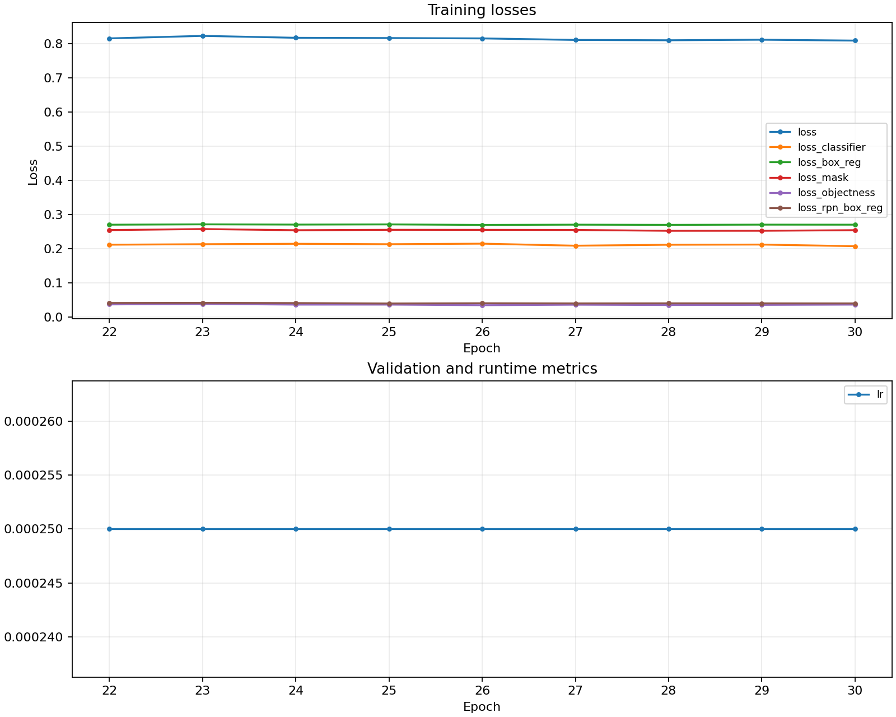
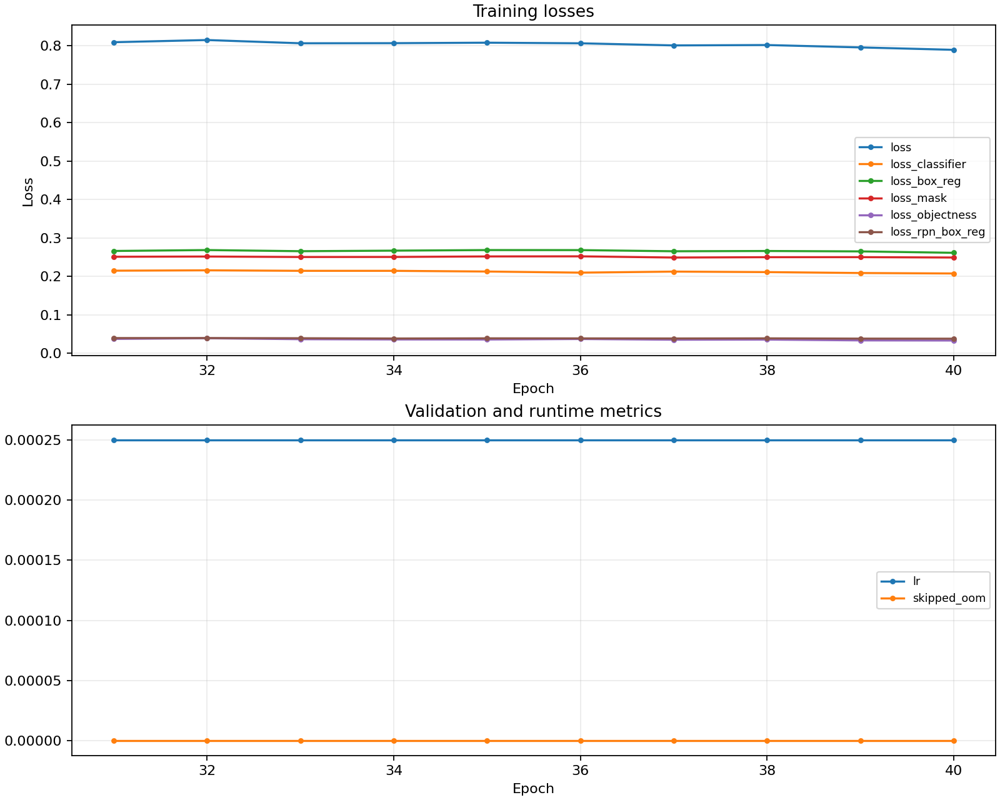

# NYCU Selected Topics in Visual Recognition using Deep Learning 2026 HW3

- Student ID: `110654013`
- Name: `簡惟捷`

## Introduction

This project is an instance segmentation system for the NYCU Selected Topics in Visual Recognition using Deep Learning 2026 Homework 3 competition.

The final method uses Torchvision Mask R-CNN with a ResNet50-FPN backbone. The model is trained only on the HW3 training set, then improved at inference time by combining whole-image predictions and native-resolution tiled predictions from two checkpoints. The final submission is produced with class-wise mask NMS and a small agreement-based score calibration.

No external cell datasets, Cellpose, StarDist, SAM, Grounded-SAM, or other non-torchvision pretrained segmentation models are used.

Project structure:

```text
hw3/
|-- README.md
|-- requirements.txt
|-- assets/
|   |-- leaderboard.png
|   |-- training_curve_epoch30.png
|   `-- training_curve_epoch40.png
|-- scripts/
|   |-- extract_data.py
|   |-- validate_data.py
|   |-- make_splits.py
|   |-- train.py
|   |-- evaluate.py
|   |-- infer.py
|   |-- infer_tiles.py
|   |-- infer_tta.py
|   |-- ensemble_submissions.py
|   `-- plot_metrics.py
|-- src/
|   `-- hw3/
|       |-- data.py
|       |-- model.py
|       |-- engine.py
|       |-- coco.py
|       |-- visualize.py
|       `-- config.py
```

The `data/` and `outputs/` folders are generated locally and are intentionally not included in this GitHub folder.

## Environment Setup

Install the required packages:

```bash
python -m pip install -r requirements.txt
```

Run a quick environment smoke test:

```bash
python scripts/smoke_test.py --data-root data/hw3-data-release
```

## Data Setup

Extract the released archive:

```bash
python scripts/extract_data.py \
  --tar hw3-data-release.tar \
  --out data/hw3-data-release
```

Validate the decoded images, masks, and generated bounding boxes:

```bash
python scripts/validate_data.py \
  --data-root data/hw3-data-release
```

Create 5-fold splits for local validation:

```bash
python scripts/make_splits.py \
  --data-root data/hw3-data-release \
  --out outputs/splits_5fold.json
```

## Method

### Dataset Conversion

Each training sample is stored as:

```text
train/<image_id>/image.tif
train/<image_id>/class1.tif
train/<image_id>/class2.tif
train/<image_id>/class3.tif
train/<image_id>/class4.tif
```

Images are read with `tifffile`. RGBA inputs are converted to RGB by dropping the alpha channel. For each `classX.tif`, every nonzero unique pixel value is treated as one object instance. Each instance is converted into:

- binary mask
- bounding box
- class label from 1 to 4
- area
- `iscrowd = 0`

### Model

The final selected model is:

- Torchvision `maskrcnn_resnet50_fpn`
- ImageNet-pretrained ResNet50 backbone
- 5 output classes including background
- small-cell anchors: `8, 16, 32, 64, 128`
- `detections_per_img = 400`

The project also supports `maskrcnn_resnet50_fpn_v2` and COCO-pretrained Torchvision weights, but the final high-scoring submission uses the ImageNet-pretrained ResNet50-FPN route.

### Final Inference Strategy

The final submission combines:

- whole-image inference
- native-resolution tiled inference
- epoch 30 checkpoint
- epoch 40 checkpoint
- class-wise mask NMS
- agreement-based score calibration

Tiled inference improves small-cell recall by applying the same Mask R-CNN model to overlapping image crops before mapping masks back to the original test image size.

## Usage

### Training

Train the aggressive full-data baseline:

```bash
python scripts/train.py \
  --data-root data/hw3-data-release \
  --final \
  --epochs 30 \
  --batch-size 2 \
  --lr 0.0025 \
  --architecture maskrcnn_r50_fpn \
  --pretrained imagenet \
  --min-sizes 512,640 \
  --max-size 1024 \
  --small-cell-anchors \
  --detections-per-img 400 \
  --hflip-prob 0.5 \
  --vflip-prob 0.5 \
  --rotate90-prob 0.5 \
  --amp \
  --tensorboard \
  --output-dir outputs/final_aggressive_v1_resume30
```

Continue training to epoch 40:

```bash
python scripts/train.py \
  --data-root data/hw3-data-release \
  --final \
  --epochs 40 \
  --batch-size 2 \
  --lr 0.0025 \
  --architecture maskrcnn_r50_fpn \
  --pretrained imagenet \
  --min-sizes 512,640 \
  --max-size 1024 \
  --small-cell-anchors \
  --detections-per-img 400 \
  --hflip-prob 0.5 \
  --vflip-prob 0.5 \
  --rotate90-prob 0.5 \
  --amp \
  --tensorboard \
  --resume outputs/final_aggressive_v1_resume30/last.pth \
  --output-dir outputs/final_aggressive_v1_epoch40_cap400
```

Training writes checkpoints, `metrics.jsonl`, `metrics.csv`, `metrics.png`, and optional TensorBoard logs under the selected output directory.

### Whole-Image Inference

Generate whole-image predictions from the epoch 30 checkpoint:

```bash
python scripts/infer.py \
  --data-root data/hw3-data-release \
  --checkpoint outputs/final_aggressive_v1_resume30/best.pth \
  --output outputs/submission/aggressive_v1_epoch30_score0p08_test-results.json \
  --architecture maskrcnn_r50_fpn \
  --pretrained imagenet \
  --min-sizes 640 \
  --max-size 1024 \
  --small-cell-anchors \
  --detections-per-img 400 \
  --score-threshold 0.08
```

Generate whole-image predictions from the epoch 40 checkpoint:

```bash
python scripts/infer.py \
  --data-root data/hw3-data-release \
  --checkpoint outputs/final_aggressive_v1_epoch40_cap400/best.pth \
  --output outputs/submission/aggressive_v1_epoch40_score0p08_test-results.json \
  --architecture maskrcnn_r50_fpn \
  --pretrained imagenet \
  --min-sizes 640 \
  --max-size 1024 \
  --small-cell-anchors \
  --detections-per-img 400 \
  --score-threshold 0.08
```

Merge the two whole-image prediction files:

```bash
python scripts/ensemble_submissions.py \
  --inputs \
    outputs/submission/aggressive_v1_epoch30_score0p08_test-results.json \
    outputs/submission/aggressive_v1_epoch40_score0p08_test-results.json \
  --output outputs/submission/ensemble_epoch30_epoch40_s010_nms050_test-results.json \
  --score-threshold 0.10 \
  --nms-threshold 0.50 \
  --agreement-boost 0.03 \
  --max-per-image-class 500
```

### Tiled Inference

Generate native-resolution tiled predictions:

```bash
python scripts/infer_tiles.py \
  --data-root data/hw3-data-release \
  --checkpoint outputs/final_aggressive_v1_resume30/best.pth \
  --output outputs/submission/tiles_epoch30_t768_s512_score0p08_test-results.json \
  --architecture maskrcnn_r50_fpn \
  --pretrained imagenet \
  --min-sizes 640 \
  --max-size 1024 \
  --small-cell-anchors \
  --detections-per-img 400 \
  --tile-size 768 \
  --stride 512 \
  --model-score-threshold 0.05 \
  --output-score-threshold 0.08 \
  --mask-threshold 0.5 \
  --nms-threshold 0.50 \
  --edge-margin 12
```

Repeat the same tiled inference command for the epoch 40 checkpoint:

```bash
python scripts/infer_tiles.py \
  --data-root data/hw3-data-release \
  --checkpoint outputs/final_aggressive_v1_epoch40_cap400/best.pth \
  --output outputs/submission/tiles_epoch40_cap400_t768_s512_score0p08_test-results.json \
  --architecture maskrcnn_r50_fpn \
  --pretrained imagenet \
  --min-sizes 640 \
  --max-size 1024 \
  --small-cell-anchors \
  --detections-per-img 400 \
  --tile-size 768 \
  --stride 512 \
  --model-score-threshold 0.05 \
  --output-score-threshold 0.08 \
  --mask-threshold 0.5 \
  --nms-threshold 0.50 \
  --edge-margin 12
```

### Final Ensemble Submission

Merge whole-image and tiled predictions using class-wise mask NMS:

```bash
python scripts/ensemble_submissions.py \
  --inputs \
    outputs/submission/ensemble_epoch30_epoch40_s010_nms050_test-results.json \
    outputs/submission/tiles_epoch30_t768_s512_score0p08_test-results.json \
    outputs/submission/tiles_epoch40_cap400_t768_s512_score0p08_test-results.json \
  --output outputs/submission/e_w_t30_t40_s08_n50_b0875.json \
  --score-threshold 0.08 \
  --nms-threshold 0.50 \
  --agreement-boost 0.0875 \
  --max-per-image-class 700
```

The platform expects the zip file to contain a file named exactly `test-results.json`. The external zip filename should be kept short because the upload system rejects long file names.

## Performance Snapshot

Final selected method:

- Mask R-CNN ResNet50-FPN
- ImageNet-pretrained backbone
- small-cell anchors
- epoch 30 and epoch 40 checkpoint ensemble
- whole-image inference
- tiled inference with `768` tile size and `512` stride
- class-wise mask NMS at `0.50`
- score threshold `0.08`
- agreement boost around `0.09`

Public leaderboard score:

```text
e_w_t30_t40_s08_n50_b0875.zip: 0.5896
```

Leaderboard snapshot:


Training curves:





Development milestones:

| Experiment | Public AP50 |
| --- | ---: |
| Fold-0 safe baseline | 0.3130 |
| Aggressive ImageNet R50-FPN, epoch 21 | 0.4755 |
| Aggressive ImageNet R50-FPN, epoch 30, score threshold 0.08 | 0.4801 |
| Whole-image epoch 30 + epoch 40 ensemble | 0.4954 |
| Whole-image + tiled ensemble, agreement boost 0.03 | 0.5594 |
| Whole-image + tiled ensemble, agreement boost 0.06 | 0.5793 |
| Whole-image + tiled ensemble, agreement boost 0.08 | 0.5876 |
| Whole-image + tiled ensemble, agreement boost 0.0875 | 0.5896 |

Important experiment observations:

- V2 COCO-pretrained Mask R-CNN was tested but did not outperform the ImageNet-pretrained ResNet50-FPN route.
- Lower test score threshold around `0.08` worked better than `0.10` or higher.
- NMS threshold `0.45` was too strict for adjacent cells and reduced performance.
- Agreement-based score calibration improved AP ranking, but tuning was stopped around `0.09` to avoid excessive public leaderboard overfitting.

## Project Notes

- Local validation uses `pycocotools` COCO AP50 for segmentation.
- Submission records contain `image_id`, `category_id`, `bbox`, `segmentation`, and `score`.
- RLE masks are encoded with `pycocotools.mask.encode`.
- The final method uses only HW3 training data and Torchvision/ImageNet initialization.
